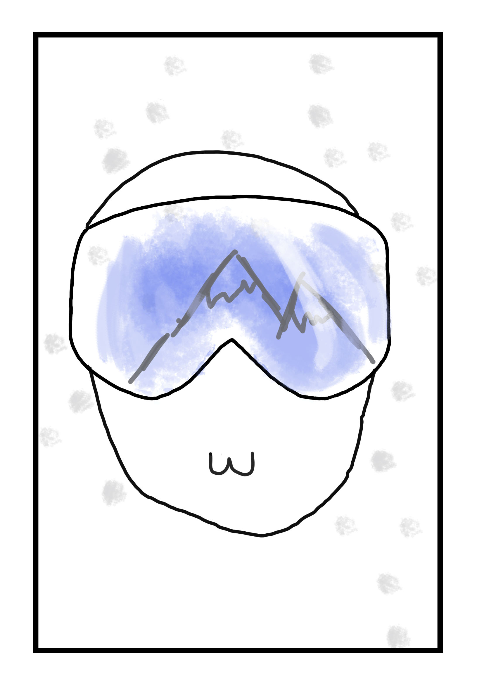
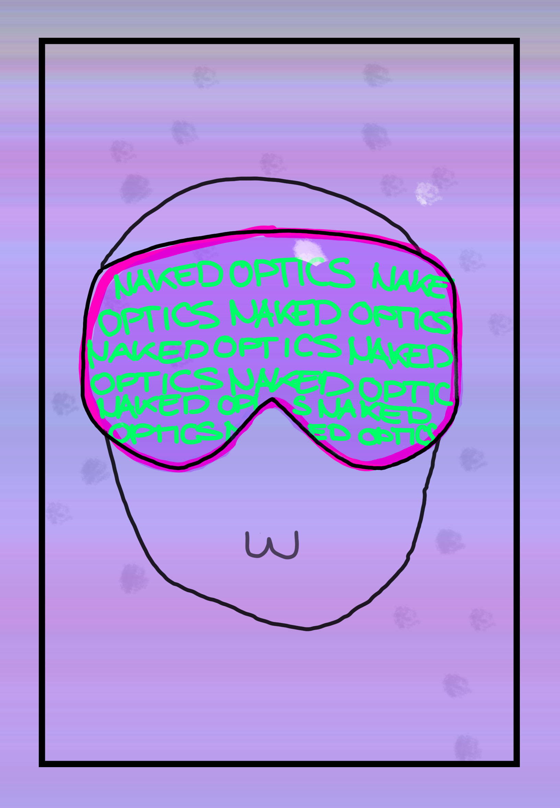
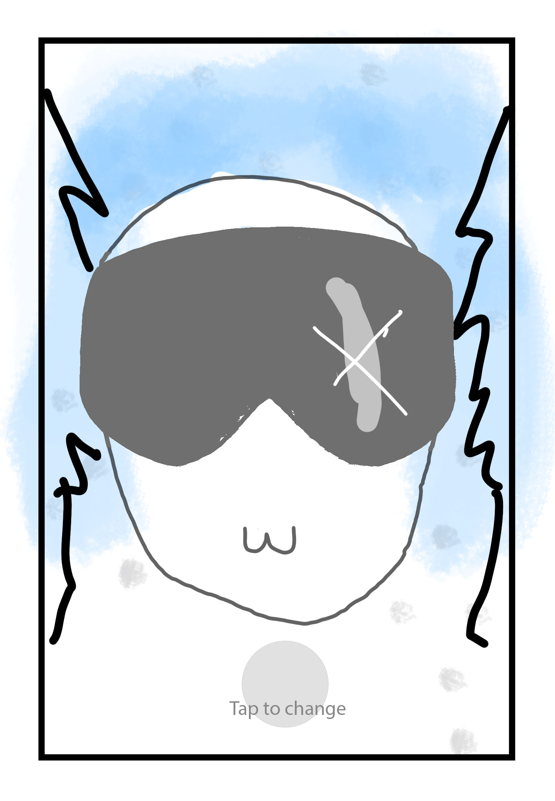
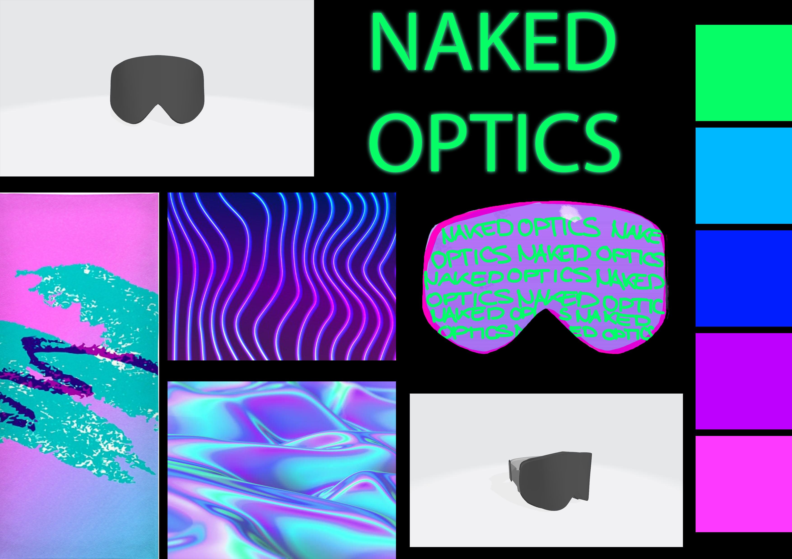

# NakedOptics-InstagramFilter-nima

## Project Description

This project is all about the (ski) glasses from the company Naked Optics based in Salzburg.
The main goal is to create a filter based on their ski-glasses for the social media platform Instagram.
Everyone will build their own individual filter with different effects on the pre modelled glasses.

## Idea

The main idea of this project is as already said to create an Instagram filter with the help of Spark AR - a software developed by facebook where you can program interactive augmented reality experiences.
A 3D model made in Autodesk Maya of Naked Optics' ski glasses will be the base where we will create different effects with Spark AR.

Some effect ideas:

* reflection of mountains 
* wind (sound)
* snow particles
* sun reflection/ lens flares
* stripes that move along the headband
* ski ramp background
* neon/ light effect on the edges of the glasses
* thermographic camera/ color effect?
* tap to change 

## Concept

What is the main idea?

My ski glasses filter will actually consist of two different filters which can be changed by tapping on the screen.

The first filter should be more natural to give the user a quick overview of how the glasses by NakedOptics could look when you wear it, whereas the second filter should be the opposite, which means a kind of "exciting" or even "crazy" style to draw attention and of course achive a fun factor.

The two different styles in detail:

Number one will have some snow particles to give the scene a winter feeling.
Also the scenery of the ski slope or some mountains in the background will be part of this filter.

Number two will be vintage or cyberpunk themed with intensive colors and a neon text that moves over the glasses which says "NakedOptics"

## Visuals/ Scribbles

## Software

* Spark AR Studio v84.0.0.16.245

## External Resources

The model as well as some of the textures of the glasses are from 3ahmnm1920-mep3 /
NakedOptics-InstagramFilter-GRUW on github

## References

* https://sparkar.facebook.com/ar-studio/
* https://www.youtube.com/watch?v=LDbmH8pyjjY
* https://www.youtube.com/watch?v=_B0G1jIaxMA
* https://www.youtube.com/watch?v=lxF-ecbkbr4
* https://www.youtube.com/watch?v=e6QdecFqUCA
* https://www.youtube.com/watch?v=JahuumWeWbI
* https://www.youtube.com/watch?v=TnWrJoPCfco
* https://sparkar.facebook.com/ar-studio/learn/documentation/building-your-scene/textures-and-materials/